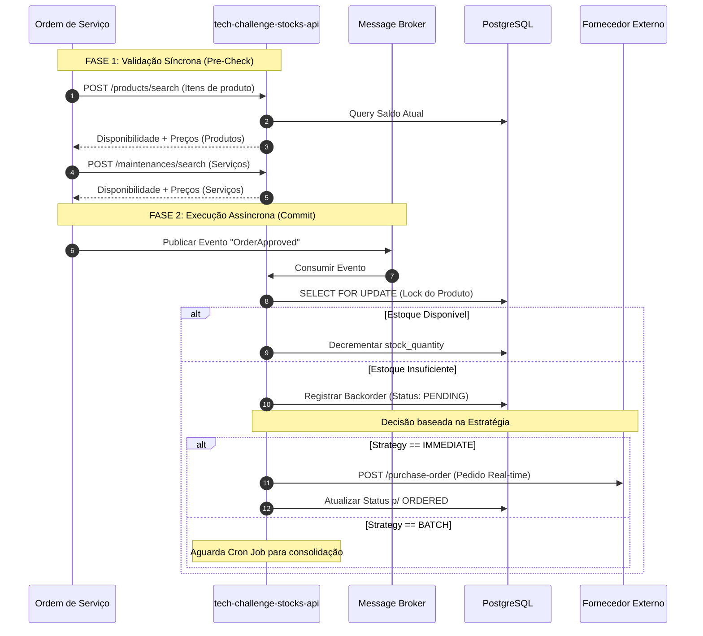

# RFC: Extração e Implementação da tech-challenge-stocks-api

**Author(s):** Tech Challenge Team
**Status:** DRAFT
**Date:** 2026-04-27

## 1. Summary (Resumo)
Esta RFC propõe a criação de um microserviço independente, denominado **tech-challenge-stocks-api**, responsável por ser a *Single Source of Truth* do catálogo de produtos e da gestão de inventário. A solução adotará uma arquitetura híbrida (síncrona para orçamentos, assíncrona orientada a eventos para baixas) e suportará estratégias de *replenishment* (reabastecimento) Just-in-Time.

## 2. Background & Motivation (Contexto)
Atualmente, o domínio de produtos e estoque encontra-se acoplado ao monólito principal, compartilhando recursos com o domínio de Ordens de Serviço.
* **Problema:** A escalabilidade do catálogo está amarrada à escalabilidade das ordens. Além disso, a gestão de estoque atua de forma reativa, sem inteligência de logística e acoplando fortemente as regras de negócio.
* **Objetivo:** Isolar o domínio para permitir o crescimento escalável, estabelecer responsabilidades claras por *role* e preparar o sistema para atuar de forma ativa na cadeia de suprimentos (Supply Chain).

## 3. Proposal (Proposta)
A extração da gestão de saldo de estoque para uma **tech-challenge-stocks-api** dedicada.
A "Gestão de Saldo" não é apenas armazenar valores numéricos, mas sim:
1. **Visibilidade (Single Source of Truth):** Proteger o saldo físico como recurso exclusivo.
2. **Integridade e Concorrência:** Utilizar locks de banco para evitar *Race Conditions* e saldo fantasma.
3. **Gestão Pró-ativa (Thresholds):** Alertas baseados em *Min Threshold*.
4. **Fluxo de Indisponibilidade (Backorder):** Tratamento formal quando a demanda supera a oferta.

## 4. Technical Design (Desenho Técnico)

### 4.1. Arquitetura Híbrida
A solução atuará em duas fases distintas:
* **Pre-Check (Síncrono):** Validação rápida via APIs REST (`/products/search` e `/maintenances/search`) para orçamentos.
* **Completion (Assíncrono):** Baixa efetiva de estoque baseada no consumo do evento de aprovação (`OrderApproved`).

### 4.2. Fluxo de Integração Dual (Diagrama)
*(O diagrama abaixo deverá ser transportado do Miro)*



### 4.3. Modelo de Dados (Persistência)

**Tabela: Product**
* `id (UUID)`: PK.
* `name (String)`
* `price (Decimal)`
* `stock_quantity (Int)`: Saldo físico.
* `min_threshold (Int)`: Ponto de pedido.
* `replenishment_strategy (Enum)`: IMMEDIATE | BATCH.
* `supplier_sku (String)`: Código do fornecedor.

**Tabela: Backorder**
* `id (UUID)`: PK.
* `product_id (UUID)`: FK.
* `order_id (UUID)`: Rastreabilidade.
* `quantity (Int)`
* `status (Enum)`: PENDING, ORDERED, RECEIVED.

### 4.4. Estratégia de Reabastecimento (Replenishment Strategy)

O sistema suporta duas estratégias de reabastecimento para lidar com a falta de estoque, definidas no nível do produto.

*   **Estratégia: `IMMEDIATE`**
    *   **Gatilho:** Acionada quando um item de uma `OrderApproved` não está disponível no estoque e sua estratégia é `IMMEDIATE`.
    *   **Fluxo:** O sistema deve imediatamente fazer uma chamada de API para o fornecedor (`POST /purchase-order`) para solicitar o reabastecimento do item. O `Backorder` correspondente é atualizado para o status `ORDERED`.
    *   **Caso de Uso:** Ideal para produtos de alta criticidade ou alto valor, onde o reabastecimento just-in-time é crucial.

*   **Estratégia: `BATCH`**
    *   **Gatilho:** Acionada quando um item de uma `OrderApproved` não está disponível e sua estratégia é `BATCH`. Um `Backorder` com status `PENDING` é criado.
    *   **Fluxo:** Um processo automatizado (cron job) será executado periodicamente (e.g., a cada 24 horas). Este job fará a varredura da tabela `Backorder` em busca de todos os registros com status `PENDING`. Ele agrupará os itens por fornecedor e criará pedidos de compra em lote.
    *   **Caso de Uso:** Recomendado para produtos de baixo custo ou menor criticidade, otimizando os custos de frete e negociação com fornecedores.

## 5. API Contracts (Contratos)

### 5.1. Consumo: Search (Sync)
* **Endpoints:** 
  * `POST /api/v1/products/search`
  * `POST /api/v1/maintenances/search`
* **Request (products/search):** `{ "ids": ["uuid-1", "uuid-2"] }`
* **Request (maintenances/search):** `{ "ids": ["uuid-3", "uuid-4"] }`
* **Response (products/search):**
```json
{
  "results": [
    {
      "id": "uuid-1",
      "available": false,
      "price": 1200.00,
      "replenishment": "REQUIRED",
      "estimated_arrival": "2026-05-01T10:00:00Z"
    }
  ]
}
```
* **Response (maintenances/search):**
```json
{
  "results": [
    {
      "id": "uuid-3",
      "name": "Troca de óleo",
      "price": 500.00
    }
  ]
}
```

### 5.2. Evento: OrderApproved (Async)
* **Tópico:** `orders.approved`
* **Payload:**
```json
{
  "order_id": "uuid-da-ordem",
  "approved_at": "timestamp",
  "items": [ { "id": "uuid", "qty": 1 } ]
}
```

### 5.3. Backoffice: Administração
* **Endpoints:** 
  * `POST /api/v1/products`: Cadastro (Inclui `supplier_sku` e `strategy`).
  * `GET /api/v1/products`: Listagem com filtros e paginação.
  * `PUT/DELETE`: Atualização e desativação lógicas.

## 6. Security & Operations (Segurança e Operações)
* **RBAC:** Controle via header `X-User-Role`. Endpoints de escrita restritos à *role* `administrator`.
* **Database Locks:** Uso obrigatório de `SELECT FOR UPDATE` para evitar inconsistências (*Race Conditions*) durante baixas de estoque concorrentes.

## 7. Trade-offs e Alternativas (Consideradas)
* **Manter tudo síncrono:** Rejeitado pois adicionaria forte acoplamento e falha em cascata caso o serviço de estoque ficasse indisponível. A abordagem híbrida resolve isso.
* **Reserva na consulta:** Rejeitado pois exigiria *cron jobs* complexos de limpeza (TTL) para orçamentos não aprovados.

## 8. Unresolved Questions (Questões em Aberto)
* Definir como ocorrerá a reconciliação caso o fornecedor rejeite a ordem da estratégia `IMMEDIATE`.


